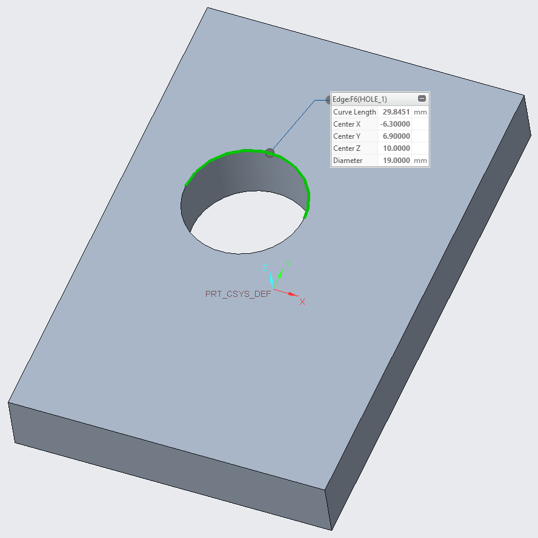

*******************************************************************************************
NOTE: THIS ITERATION HAS CHANGED. THE CHANGE THAT WAS PREVIOUSLY ITERATION 0.3 IS NOW 0.2
*******************************************************************************************
The original iteration was done in NX. The change was deleting a point from within a sketch that located a hole center and then adding a new point to that sketch. Creo and CATIA do not allow such changes, therefore this change was dropped.

In this iteration, the hole feature was deleted and a new diameter 19 hole feature was created at (-6.3, 6.9, 10)

