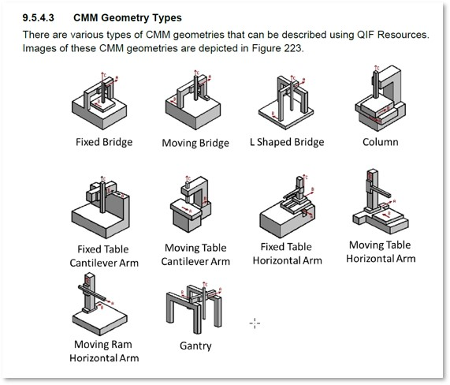
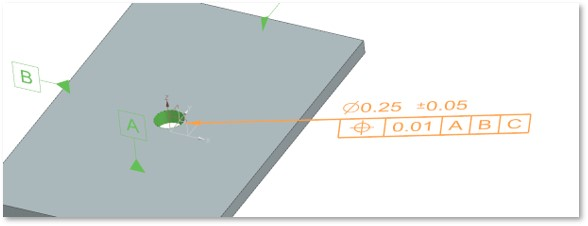

Issues against design iteration 0.0
# Issue 1: Datum A should be on top of part
## Details:
### Contributor: Larry et al.
Datum A is on the ‘underside’ of the plate, so the Datum A plane normal vector is Z negative while the CAD Coordinate System is Z positive. 
Most CMMs define the C axis positive direction as shown below from the QIF PDF.

## Analysis:
Easy to implement, not critical to design
## Resolution:
Accept, implement in revision 0.5.

# Issue 2: Model diameter and position associated with a circle (edge of a plane and cylinder).
## Details:
### Contributor: Larry et al.
The NX model’s diameter and position is associated with a circle (edge of a plane and cylinder).
It not recommended practice to measure an edge with a contact sensor.  Non-contact sensors are recommended.
Again, not wrong but adds to CMM configuration complexity, and of course, cost.

As defined, the size and position constraints only apply to the top edge of the cylinder, not the cylinder’s surface.

I suggest re-association of the two characteristics to the cylinder’s face.

## Analysis:
May be difficult to resolve in source tool.
AP 242 PMI group has moved to only references specific faces in the udated mode for annotations but we would need to include both the face and one of the face_bounds.
Further analysis required.

## Resolution:
Waiting on analysis

# Issue 3: Increase the material thickness
## Details:
### Contributor: Larry et al.
I also increased the material thickness from .125 to .250.  
The smallest ‘standard’ stylus is 2 mm  (0.08), a little large for a 0.125 feature.
## Analysis:

Dessign Engineer is ok with change.
## Resolution:
Accept, Incorporate in rev 0.5.

# Issue 4: Color
## Details:

### Contributor: Larry et al.
I also changed color for a little more contrast. 
## Analysis:
Where is color defined in the step file?
## Resolution:
waiting on response from contributor.
